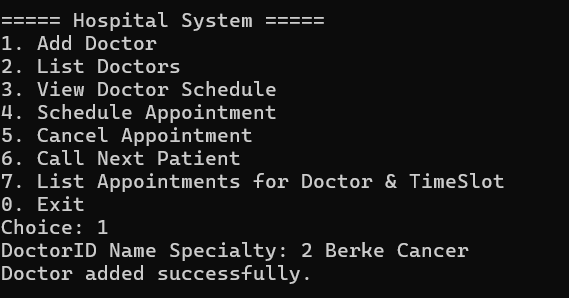
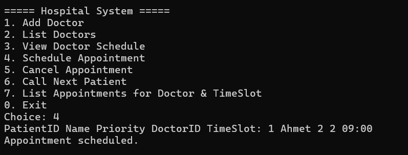
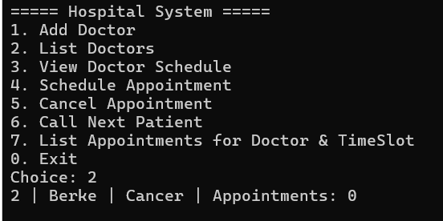
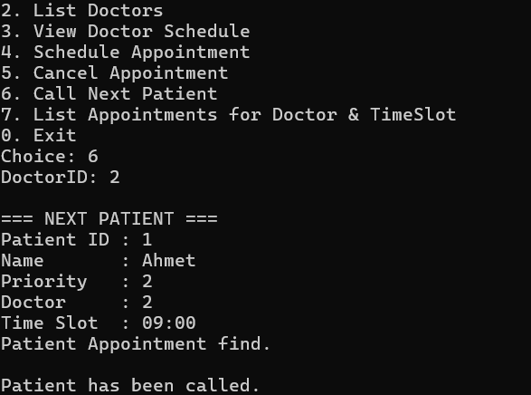
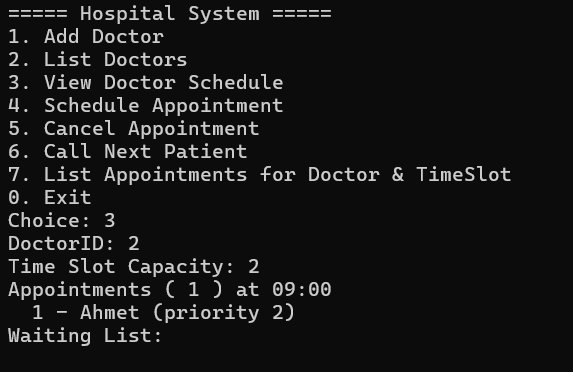
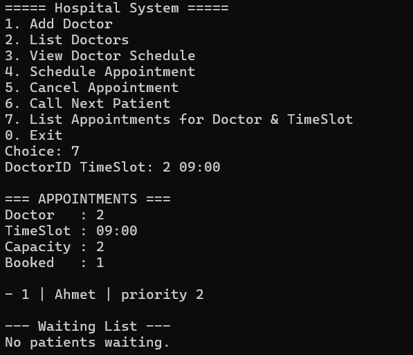

# Hospital Management System - Architecture Documentation

## Table of Contents
1. [System Overview](#system-overview)
2. [Architecture Diagram](#architecture-diagram)
3. [Core Components](#core-components)
4. [Class Descriptions](#class-descriptions)
5. [Data Structures & Algorithms](#data-structures--algorithms)
6. [Design Patterns](#design-patterns)
7. [File I/O Operations](#file-io-operations)
8. [Code Examples](#code-examples)

---

## System Overview

This is a comprehensive **Hospital Management System** built in C++ that manages doctors, patients, appointments, and a triage queue system. The system uses STL containers for efficient data management and implements priority-based patient scheduling.

**Key Features:**
- Doctor management (add, list, view schedules)
- Appointment scheduling with capacity management
- Priority-based triage queue for patient calling
- Waiting list management when slots are full
- Persistent storage using text files
- Time slot management with configurable capacity

---

## Architecture Diagram

```
┌─────────────────────────────────────────────────────────────────┐
│                         Main Program                             │
│                    (MBA_5001230021.cpp)                          │
└────────────────────────────┬────────────────────────────────────┘
                             │
                             ▼
┌─────────────────────────────────────────────────────────────────┐
│                      HospitalSystem                              │
│  ┌──────────────────────────────────────────────────────────┐   │
│  │  - map<string, Doctor> doctors                           │   │
│  │  - priority_queue<TriageEntry> triageQueue               │   │
│  │  - int triageOrderCounter                                │   │
│  └──────────────────────────────────────────────────────────┘   │
│                                                                   │
│  Public Methods:                                                 │
│  • addDoctor()              • scheduleAppointment()              │
│  • listDoctors()            • cancelAppointment()                │
│  • viewDoctorSchedule()     • callNextPatient()                  │
│  • listAppointmentsFor()    • runMenu()                          │
└───────────┬────────────────────────────┬────────────────────────┘
            │                            │
            ▼                            ▼
    ┌──────────────┐          ┌──────────────────┐
    │   Doctor     │          │  TriageEntry     │
    │              │          │  + Comparator    │
    └──────┬───────┘          └──────────────────┘
           │
           │ contains map<string, TimeSlotInfo>
           │
           ▼
    ┌──────────────────┐
    │  TimeSlotInfo    │
    │  • capacity      │
    │  • appointments  │───────┐
    │  • waitingList   │       │
    └──────────────────┘       │
                               ▼
                    ┌─────────────────┐
                    │  Appointment    │
                    │  • doctorID     │
                    │  • patientID    │
                    │  • timeSlot     │
                    │  • priority     │
                    └─────────────────┘
                               │
                               │ references
                               ▼
                    ┌─────────────────┐
                    │    Patient      │
                    │  • patientID    │
                    │  • name         │
                    │  • priority     │
                    └─────────────────┘
```

---

## Core Components

### 1. **HospitalSystem** (Central Controller)
- **Purpose**: Main system controller that orchestrates all operations
- **Responsibilities**: 
  - Manages all doctors in the system
  - Handles appointment scheduling and cancellation
  - Maintains priority queue for patient triage
  - Performs file I/O operations
  - Provides user interface menu

### 2. **Doctor** (Entity)
- **Purpose**: Represents a doctor with their schedule
- **Responsibilities**:
  - Stores doctor information (ID, name, specialty)
  - Manages time slots with their capacities
  - Provides access to schedule information

### 3. **Patient** (Entity)
- **Purpose**: Represents a patient in the system
- **Responsibilities**:
  - Stores patient information (ID, name, priority level)
  - Provides getter/setter methods for patient data

### 4. **Appointment** (Entity)
- **Purpose**: Represents a scheduled appointment
- **Responsibilities**:
  - Links patient, doctor, and time slot
  - Stores priority information for triage

### 5. **TimeSlotInfo** (Resource Manager)
- **Purpose**: Manages a specific time slot for a doctor
- **Responsibilities**:
  - Controls capacity limits
  - Maintains appointment list
  - Manages waiting list when full
  - Provides operations to add/remove appointments

### 6. **TriageEntry** (Priority Queue Element)
- **Purpose**: Represents an entry in the triage queue
- **Responsibilities**:
  - Stores all relevant information for patient calling
  - Enables priority-based sorting with FIFO for same priorities

---

## Class Descriptions

### 1. Patient Class

```cpp
class Patient {
private:
    std::string patientID;      // Unique identifier
    std::string namePAT;        // Patient name
    int priorityLevel;          // Priority (lower = higher priority)

public:
    Patient(std::string pID, std::string namePatient, int PriLevel);
    
    // Getters
    const std::string getpID() const;
    const std::string getnamePat() const;
    const int getpriLevel() const;
    
    // Setters
    void setpriLevel(int inputpriLevel);
    void setnamePat(std::string nameInput);
    void setPID(std::string PIDInput);
    
    // Operator overload for printing
    friend std::ostream& operator<<(std::ostream& os, const Patient& p);
};
```

**Key Features:**
- Simple data holder for patient information
- Priority level determines urgency (lower number = higher priority)
- Overloaded `<<` operator for easy printing

**Usage Example:**
```cpp
Patient patient("P001", "JohnDoe", 2);
std::cout << patient;  // Prints patient info
std::cout << patient.getpID();  // "P001"
```

---

### 2. Doctor Class

```cpp
class Doctor {
private:
    std::string doctorID;                           // Unique ID
    std::string name;                               // Doctor name
    std::string specialty;                          // Medical specialty
    std::map<std::string, TimeSlotInfo> schedule;   // Time slots map

public:
    Doctor(std::string dID, std::string nameDoctor, std::string specialtyDoctor);
    
    // Time slot management
    void addTimeSlot(const std::string& timeSlot, int capacity);
    TimeSlotInfo* getTimeSlot(const std::string& timeSlot);
    
    // Display and access
    void printSchedule() const;
    const std::string getdName() const;
    const std::string getdSpecialty() const;
    const std::string getdID() const;
    const std::map<std::string, TimeSlotInfo>& getSchedule() const;
};
```

**Key Features:**
- Uses `std::map` to store time slots (key: time string like "09:00")
- Each time slot has its own capacity and appointment list
- Can print complete schedule with appointments and waiting lists

**Schedule Structure:**
```
Doctor: D001 (John Smith - Cardiology)
  ├── TimeSlot: 09:00 (Capacity: 2)
  │   ├── Appointment 1: P001 - PatientA (priority 1)
  │   ├── Appointment 2: P002 - PatientB (priority 3)
  │   └── Waiting: P003 - PatientC (priority 2)
  └── TimeSlot: 10:00 (Capacity: 2)
      └── Appointment 1: P004 - PatientD (priority 1)
```

**Usage Example:**
```cpp
Doctor doctor("D001", "JohnSmith", "Cardiology");
doctor.addTimeSlot("09:00", 2);  // Add time slot with capacity 2
TimeSlotInfo* slot = doctor.getTimeSlot("09:00");
doctor.printSchedule();  // Display all appointments
```

---

### 3. Appointment Class

```cpp
class Appointment {
private:
    std::string doctorID;      // Doctor identifier
    std::string patientID;     // Patient identifier
    std::string patientName;   // Patient name (for convenience)
    std::string timeSlot;      // Time (e.g., "09:00")
    int priLevel;              // Priority level

public:
    Appointment(const std::string& doctorID,
                const std::string& patientID,
                const std::string& patientName,
                const std::string& timeSlot,
                int priorityLevel);
    
    // Getters
    const std::string& getPatientID() const;
    const std::string& getPatientName() const;
    int getPriorityLevel() const;
};
```

**Key Features:**
- Immutable after creation (no setters)
- Stores redundant patient name for faster access
- Links patient, doctor, and time slot together

**Usage Example:**
```cpp
Appointment apt("D001", "P001", "JohnDoe", "09:00", 2);
std::cout << apt.getPatientID();  // "P001"
std::cout << apt.getPriorityLevel();  // 2
```

---

### 4. TimeSlotInfo Class

```cpp
class TimeSlotInfo {
private:
    std::string timeSlot;                      // Time (e.g., "09:00")
    int capacity;                              // Max appointments
    std::vector<Appointment> appointments;      // Confirmed appointments
    std::queue<Patient> waitingList;           // Overflow patients

public:
    TimeSlotInfo(const std::string ts, int c);
    
    // Status checks
    bool isFullAppointments();
    bool isFullWaitingList();
    
    // Appointment operations
    bool addAppointment(const Appointment& a);
    bool removeAppointmentByPatientID(const std::string& patientID);
    
    // Waiting list operations
    void addToWaitingList(const Patient& p);
    Patient popFromWaitingList();
    
    // Getters
    int getCapacity() const;
    size_t getAppointmentCount() const;
    const std::vector<Appointment>& getAppointments() const;
    const std::queue<Patient>& getWaitingList() const;
};
```

**Key Features:**
- **Capacity Management**: Limits number of appointments per slot
- **Overflow Handling**: Uses waiting list when capacity is reached
- **FIFO Waiting List**: Uses `std::queue` for fair ordering

**State Diagram:**
```
┌─────────────────────────────────────────┐
│      TimeSlot: 09:00 (Capacity: 2)      │
├─────────────────────────────────────────┤
│  Appointments: [Appt1, Appt2]  FULL ✓   │
│  Waiting List: [Patient1, Patient2]     │
└─────────────────────────────────────────┘

When Appointment Canceled:
  ↓
  1. Remove from appointments vector
  2. Check if waiting list has patients
  3. If yes: Pop from waiting list → Add as appointment
  4. Update triage queue
```

**Usage Example:**
```cpp
TimeSlotInfo slot("09:00", 2);

// Add appointments
Appointment apt1("D001", "P001", "John", "09:00", 1);
bool added = slot.addAppointment(apt1);  // true if not full

// Add to waiting list when full
Patient p("P003", "Jane", 2);
if (!slot.addAppointment(apt2)) {
    slot.addToWaitingList(p);
}

// Remove appointment
slot.removeAppointmentByPatientID("P001");

// Move from waiting to appointment
if (!slot.getWaitingList().empty()) {
    Patient next = slot.popFromWaitingList();
    Appointment newApt("D001", next.getpID(), 
                       next.getnamePat(), "09:00", 
                       next.getpriLevel());
    slot.addAppointment(newApt);
}
```

---

### 5. TriageEntry Struct & Comparator

```cpp
struct TriageEntry {
    int priorityLevel;       // Priority (lower = higher priority)
    std::string patientID;   // Patient identifier
    std::string patientName; // Patient name
    std::string doctorID;    // Assigned doctor
    std::string timeSlot;    // Scheduled time
    int order;               // Insertion order for FIFO
};

struct TriageComparator {
    bool operator()(const TriageEntry& a, const TriageEntry& b) const {
        // Lower priority number = higher priority
        if (a.priorityLevel == b.priorityLevel)
            return a.order > b.order;  // FIFO for same priority
        return a.priorityLevel > b.priorityLevel;  // Min-heap
    }
};
```

**Key Features:**
- **Priority-based**: Lower priority number = higher urgency
- **FIFO Tie-breaking**: For same priority, first come first served
- **Complete Information**: Contains all data needed to call patient

**Priority Queue Behavior:**
```
Priority Queue (using TriageComparator):
┌────────────────────────────────────────┐
│  Top → Priority 1, Order 1 (P001)      │  ← Called first
│        Priority 1, Order 3 (P003)      │  ← Same priority, later order
│        Priority 2, Order 2 (P002)      │
│        Priority 3, Order 4 (P004)      │
└────────────────────────────────────────┘

When callNextPatient("D001"):
  1. Pop top entry from queue
  2. Check if doctorID matches
  3. Check if patient still has appointment
  4. If valid: display info and remove appointment
  5. If invalid: try next entry
```

**Usage Example:**
```cpp
std::priority_queue<TriageEntry, 
                    std::vector<TriageEntry>, 
                    TriageComparator> triageQueue;

// Add entries
triageQueue.push({1, "P001", "John", "D001", "09:00", 0});
triageQueue.push({3, "P002", "Jane", "D001", "09:00", 1});
triageQueue.push({1, "P003", "Bob", "D001", "10:00", 2});

// Top will be: P001 (priority 1, order 0)
TriageEntry next = triageQueue.top();
triageQueue.pop();
```

---

### 6. HospitalSystem Class

```cpp
class HospitalSystem {
private:
    std::map<std::string, Doctor> doctors;
    std::priority_queue<TriageEntry, 
                        std::vector<TriageEntry>, 
                        TriageComparator> triageQueue;
    int triageOrderCounter;
    
    // File operations
    void loadDoctorsFromFile();
    void loadAppointmentsFromFile();
    void rewriteAppointmentsFile() const;
    void appendDoctorToFile(const Doctor& d) const;

public:
    HospitalSystem();
    
    // Validation
    bool isValidTime(const std::string& time) const;
    
    // Doctor operations
    void addDoctor(const Doctor& d);
    void listDoctors() const;
    void viewDoctorSchedule(const std::string& doctorID) const;
    
    // Appointment operations
    void scheduleAppointment(const Patient& p, 
                            const std::string& doctorID, 
                            const std::string& timeSlot);
    void cancelAppointment(const std::string& doctorID, 
                          const std::string& timeSlot, 
                          const std::string& patientID);
    void listAppointmentsFor(const std::string& doctorID, 
                            const std::string& timeSlot) const;
    
    // Triage operations
    void callNextPatient(const std::string& doctorID);
    
    // User interface
    void runMenu();
};
```

**Key Features:**
- **Central Controller**: Manages entire system state
- **Persistent Storage**: Automatically saves/loads from files
- **Smart Scheduling**: Auto-creates time slots if missing
- **Automatic Promotion**: Moves patients from waiting list to appointments

---

## Data Structures & Algorithms

### 1. Map for Doctor Storage
```cpp
std::map<std::string, Doctor> doctors;
```
- **Type**: Red-Black Tree (balanced BST)
- **Time Complexity**: O(log n) for insert, find, delete
- **Why Used**: Fast doctor lookup by ID, maintains sorted order

### 2. Priority Queue for Triage
```cpp
std::priority_queue<TriageEntry, 
                    std::vector<TriageEntry>, 
                    TriageComparator> triageQueue;
```
- **Type**: Max-Heap (with custom comparator for min-heap behavior)
- **Time Complexity**: O(log n) insert, O(1) top, O(log n) pop
- **Why Used**: Efficiently get highest priority patient

### 3. Vector for Appointments
```cpp
std::vector<Appointment> appointments;
```
- **Type**: Dynamic array
- **Time Complexity**: O(1) push_back, O(n) search/remove
- **Why Used**: Small size per slot, random access needed

### 4. Queue for Waiting List
```cpp
std::queue<Patient> waitingList;
```
- **Type**: FIFO queue (typically implemented as deque)
- **Time Complexity**: O(1) push, O(1) pop, O(1) front
- **Why Used**: Fair first-come-first-served ordering

### Complexity Analysis

#### Common Operations:
| Operation | Time Complexity | Data Structure Used |
|-----------|----------------|---------------------|
| Add Doctor | O(log n) | `std::map` |
| Find Doctor | O(log n) | `std::map` |
| Add Appointment | O(1) amortized | `std::vector` |
| Remove Appointment | O(n) | `std::vector` linear search |
| Add to Triage | O(log n) | `std::priority_queue` |
| Call Next Patient | O(k log n) | `std::priority_queue` (k = invalid entries) |
| Add to Waiting List | O(1) | `std::queue` |

---

## Design Patterns

### 1. **Facade Pattern**
**Where**: `HospitalSystem` class
**Purpose**: Provides simple interface to complex subsystem

```cpp
// Complex internal operations hidden
void HospitalSystem::scheduleAppointment(...) {
    // 1. Find doctor
    // 2. Get/create time slot
    // 3. Add appointment
    // 4. Handle waiting list if full
    // 5. Update triage queue
    // 6. Save to file
}

// User just calls one method
system.scheduleAppointment(patient, "D001", "09:00");
```

### 2. **Separation of Concerns**
Each class has single responsibility:
- `Patient`: Patient data
- `Doctor`: Doctor data and schedule
- `TimeSlotInfo`: Slot capacity management
- `Appointment`: Appointment data
- `HospitalSystem`: Orchestration and coordination

### 3. **Data Encapsulation**
All data members are private with public getters/setters:
```cpp
class Patient {
private:
    std::string patientID;  // Hidden
public:
    const std::string getpID() const;  // Controlled access
};
```

---

## File I/O Operations

### File Structure

#### doctors.txt
```
D001 JohnSmith Cardiology
D002 JaneDoe Neurology
D003 BobJones Pediatrics
```
**Format**: `DoctorID Name Specialty`

#### appointments.txt
```
D001 09:00 P001 JohnDoe 1
D001 09:00 P002 JaneSmith 3
D002 10:00 P003 BobJones 2
```
**Format**: `DoctorID TimeSlot PatientID PatientName Priority`

### Loading Process

```cpp
void HospitalSystem::loadDoctorsFromFile() {
    std::ifstream in("doctors.txt");
    if (!in) return;
    
    std::string id, name, spec;
    while (in >> id >> name >> spec) {
        doctors.emplace(id, Doctor(id, name, spec));
    }
}

void HospitalSystem::loadAppointmentsFromFile() {
    std::ifstream in("appointments.txt");
    if (!in) return;
    
    std::string doctorID, timeSlot, patientID, patientName;
    int priorityLevel;
    
    while (in >> doctorID >> timeSlot >> patientID 
                >> patientName >> priorityLevel) {
        
        auto it = doctors.find(doctorID);
        if (it == doctors.end()) continue;
        
        // Get or create time slot
        TimeSlotInfo* slot = it->second.getTimeSlot(timeSlot);
        if (!slot) {
            it->second.addTimeSlot(timeSlot, 2);  // Default capacity
            slot = it->second.getTimeSlot(timeSlot);
        }
        
        // Add appointment
        Appointment a(doctorID, patientID, patientName, 
                     timeSlot, priorityLevel);
        slot->addAppointment(a);
        
        // Add to triage queue
        triageQueue.push({priorityLevel, patientID, patientName,
                         doctorID, timeSlot, triageOrderCounter++});
    }
}
```

### Saving Process

```cpp
void HospitalSystem::rewriteAppointmentsFile() const {
    std::ofstream out("appointments.txt");
    
    // Iterate all doctors
    for (const auto& dPair : doctors) {
        const Doctor& d = dPair.second;
        
        // Iterate all time slots
        for (const auto& sPair : d.getSchedule()) {
            const std::string& ts = sPair.first;
            const TimeSlotInfo& slot = sPair.second;
            
            // Write all appointments
            for (const auto& a : slot.getAppointments()) {
                out << d.getdID() << " "
                    << ts << " "
                    << a.getPatientID() << " "
                    << a.getPatientName() << " "
                    << a.getPriorityLevel() << "\n";
            }
        }
    }
}

void HospitalSystem::appendDoctorToFile(const Doctor& d) const {
    std::ofstream out("doctors.txt", std::ios::app);
    out << d.getdID() << " "
        << d.getdName() << " "
        << d.getdSpecialty() << "\n";
}
```

---

## Code Examples

### Example 1: Complete Workflow - Adding Doctor and Scheduling Appointment

```cpp
int main() {
    HospitalSystem system;
    
    // 1. Add a doctor
    Doctor cardio("D001", "DrSmith", "Cardiology");
    system.addDoctor(cardio);
    // Output: "Doctor added successfully."
    
    // 2. List all doctors
    system.listDoctors();
    
    // 3. Doctor automatically gets time slots when needed
    // No need to manually add time slots
    
    // 3. Schedule appointment
    Patient patient("P001", "JohnDoe", 1);  // Priority 1 (urgent)
    system.scheduleAppointment(patient, "D001", "09:00");
    // Output: "Appointment scheduled."
    // System auto-creates time slot "09:00" with capacity 2
    
    // 4. Schedule another appointment (same slot)
    Patient patient2("P002", "JaneSmith", 3);  // Priority 3 (less urgent)
    system.scheduleAppointment(patient2, "D001", "09:00");
    // Output: "Appointment scheduled."
    
    // 5. Try to schedule third appointment (slot full)
    Patient patient3("P003", "BobJones", 2);
    system.scheduleAppointment(patient3, "D001", "09:00");
    // Output: "Slot full. Added to waiting list."
    
    return 0;
}
```

**System Output - Add Doctor:**



**System Output - Schedule Appointment:**



**System Output - List Doctors:**



---

### Example 2: Triage Queue in Action

```cpp
void demonstrateTriage() {
    HospitalSystem system;
    
    // Setup
    Doctor doc("D001", "DrSmith", "Cardiology");
    system.addDoctor(doc);
    
    // Schedule multiple patients with different priorities
    system.scheduleAppointment(Patient("P001", "Alice", 3), "D001", "09:00");
    system.scheduleAppointment(Patient("P002", "Bob", 1), "D001", "09:00");
    system.scheduleAppointment(Patient("P003", "Charlie", 1), "D001", "10:00");
    system.scheduleAppointment(Patient("P004", "Diana", 2), "D001", "10:00");
    
    /* Triage Queue State (priority, order):
       Top → (1, 1) P002 Bob      ← Highest priority, called first
             (1, 2) P003 Charlie  ← Same priority, but later order
             (2, 3) P004 Diana
             (3, 0) P001 Alice    ← Lowest priority
    */
    
    // Call patients in priority order
    system.callNextPatient("D001");
    // Output:
    // === NEXT PATIENT ===
    // Patient ID : P002
    // Name       : Bob
    // Priority   : 1
    // ...
    
    system.callNextPatient("D001");
    // Now calls P003 Charlie (next priority 1 patient)
}
```

**System Output - Call Next Patient:**



### Example 3: Cancellation with Waiting List Promotion

```cpp
void demonstrateCancellation() {
    HospitalSystem system;
    
    Doctor doc("D001", "DrSmith", "Cardiology");
    system.addDoctor(doc);
    
    // Fill time slot capacity (2)
    system.scheduleAppointment(Patient("P001", "Alice", 1), "D001", "09:00");
    system.scheduleAppointment(Patient("P002", "Bob", 2), "D001", "09:00");
    
    // Add to waiting list (slot full)
    system.scheduleAppointment(Patient("P003", "Charlie", 3), "D001", "09:00");
    // Output: "Slot full. Added to waiting list."
    
    /* Current State:
       Appointments: [P001 Alice, P002 Bob]  (2/2 full)
       Waiting: [P003 Charlie]
    */
    
    // Cancel Alice's appointment
    system.cancelAppointment("D001", "09:00", "P001");
    // Output:
    // "Appointment cancelled."
    // "Charlie moved from waiting list."
    
    /* New State:
       Appointments: [P002 Bob, P003 Charlie]  (2/2 full)
       Waiting: []
    */
    
    // Charlie is now automatically scheduled!
}
```

### Example 4: Viewing Schedule

```cpp
void demonstrateScheduleView() {
    HospitalSystem system;
    
    Doctor doc("D001", "DrSmith", "Cardiology");
    system.addDoctor(doc);
    
    system.scheduleAppointment(Patient("P001", "Alice", 1), "D001", "09:00");
    system.scheduleAppointment(Patient("P002", "Bob", 2), "D001", "09:00");
    system.scheduleAppointment(Patient("P003", "Charlie", 1), "D001", "10:00");
    
    // View complete schedule
    system.viewDoctorSchedule("D001");
    
    /* Output:
       Time Slot Capacity: 2
       Appointments ( 2 ) at 09:00
         P001 - Alice (priority 1)
         P002 - Bob (priority 2)
       Waiting List:
       
       Time Slot Capacity: 2
       Appointments ( 1 ) at 10:00
         P003 - Charlie (priority 1)
       Waiting List:
    */
    
**System Output - View Doctor Schedule:**


    
    // View specific time slot
    system.listAppointmentsFor("D001", "09:00");
    
    /* Output:
       === APPOINTMENTS ===
       Doctor   : D001
       TimeSlot : 09:00
       Capacity : 2
       Booked   : 2
       
       - P001 | Alice | priority 1
       - P002 | Bob | priority 2
       
       --- Waiting List ---
       No patients waiting.
    */
}
```

**System Output - List Appointments:**



### Example 5: Time Validation

```cpp
void demonstrateTimeValidation() {
    HospitalSystem system;
    
    // Valid times
    bool valid1 = system.isValidTime("09:00");  // true
    bool valid2 = system.isValidTime("23:59");  // true
    
    // Invalid times
    bool invalid1 = system.isValidTime("9:00");   // false (wrong format)
    bool invalid2 = system.isValidTime("25:00");  // false (invalid hour)
    bool invalid3 = system.isValidTime("09:60");  // false (invalid minute)
    bool invalid4 = system.isValidTime("09-00");  // false (wrong separator)
    
    // When scheduling with invalid time
    Doctor doc("D001", "DrSmith", "Cardiology");
    system.addDoctor(doc);
    
    Patient patient("P001", "Alice", 1);
    system.scheduleAppointment(patient, "D001", "25:00");
    // System will still process, but menu validates before calling
}
```

### Example 6: Menu System Flow

```cpp
void demonstrateMenuSystem() {
    HospitalSystem system;
    system.runMenu();
    
    /* Sample Interaction:
    
    ===== Hospital System =====
    1. Add Doctor
    2. List Doctors
    3. View Doctor Schedule
    4. Schedule Appointment
    5. Cancel Appointment
    6. Call Next Patient
    7. List Appointments for Doctor & TimeSlot
    0. Exit
    Choice: 1
    DoctorID Name Specialty: D001 DrSmith Cardiology
    Doctor added successfully.
    
    ===== Hospital System =====
    ...
    Choice: 4
    PatientID Name Priority DoctorID TimeSlot: P001 Alice 1 D001 09:00
    Appointment scheduled.
    
    ===== Hospital System =====
    ...
    Choice: 6
    DoctorID: D001
    
    === NEXT PATIENT ===
    Patient ID : P001
    Name       : Alice
    Priority   : 1
    Doctor     : D001
    Time Slot  : 09:00
    
    Patient has been called.
    */
}
```

### Example 7: Edge Cases Handling

```cpp
void demonstrateEdgeCases() {
    HospitalSystem system;
    
    // 1. Schedule appointment for non-existent doctor
    Patient p1("P001", "Alice", 1);
    system.scheduleAppointment(p1, "D999", "09:00");
    // Output: "Doctor not found."
    
    // 2. Call next patient when queue is empty
    Doctor doc("D001", "DrSmith", "Cardiology");
    system.addDoctor(doc);
    system.callNextPatient("D001");
    // Output: "No patients waiting."
    
    // 3. Cancel non-existent appointment
    system.cancelAppointment("D001", "09:00", "P999");
    // Output: "Time slot not found."
    
    // 4. Add duplicate doctor
    system.addDoctor(Doctor("D001", "DrJones", "Surgery"));
    // Output: "Doctor ID is exists"
    
    // 5. View schedule for doctor with no appointments
    system.viewDoctorSchedule("D001");
    // Output: "No schedule available for this doctor."
}
```

### Example 8: Persistence Across Sessions

```cpp
// Session 1
void session1() {
    HospitalSystem system;
    
    Doctor doc("D001", "DrSmith", "Cardiology");
    system.addDoctor(doc);
    
    system.scheduleAppointment(Patient("P001", "Alice", 1), "D001", "09:00");
    system.scheduleAppointment(Patient("P002", "Bob", 2), "D001", "09:00");
    
    // Data saved to files: doctors.txt, appointments.txt
}

// Session 2 (after restart)
void session2() {
    HospitalSystem system;  // Constructor loads from files
    
    // All doctors and appointments are restored!
    system.listDoctors();
    // Output:
    // D001 | DrSmith | Cardiology | Appointments: 2
    
    system.viewDoctorSchedule("D001");
    // Shows Alice and Bob's appointments
    
    // Can continue working
    system.callNextPatient("D001");
    // Calls Alice (priority 1)
}
```

---

## System Initialization Flow

```cpp
HospitalSystem::HospitalSystem() : triageOrderCounter(0) {
    loadDoctorsFromFile();      // Load doctors.txt
    loadAppointmentsFromFile(); // Load appointments.txt
}
```

**Initialization Steps:**
1. Set triage order counter to 0
2. Load all doctors from `doctors.txt` into `doctors` map
3. Load all appointments from `appointments.txt`:
   - For each appointment, find the doctor
   - Create time slot if it doesn't exist (capacity 2)
   - Add appointment to the slot
   - Add entry to triage queue with incremented order counter
4. System ready to use

---

## Key Algorithms

### 1. Call Next Patient Algorithm

```
Algorithm: callNextPatient(doctorID)

1. Check if doctor exists → if not, return error
2. Check if triage queue is empty → if yes, return "no patients"
3. Create temporary priority queue for non-matching entries
4. Loop while triage queue not empty:
   a. Pop top entry from triage queue
   b. If entry.doctorID ≠ requested doctorID:
      - Push to temp queue (save for later)
      - Continue to next entry
   c. Check if time slot exists → if not, continue
   d. Check if patient still has appointment in that slot
      - Search appointment list for patientID
      - If not found, continue (appointment was cancelled)
   e. VALID PATIENT FOUND:
      - Display patient information
      - Remove appointment from slot
      - Save changes to file
      - Restore temp queue entries back to triage queue
      - Return success
5. If no valid patient found:
   - Restore all entries from temp queue
   - Return "no valid patients"

Time Complexity: O(k log n) where k = entries checked, n = queue size
```

### 2. Schedule Appointment Algorithm

```
Algorithm: scheduleAppointment(patient, doctorID, timeSlot)

1. Find doctor by ID → if not found, return error
2. Get time slot from doctor's schedule
3. If time slot doesn't exist:
   - Auto-create new time slot with default capacity 2
   - Get newly created slot
4. Create Appointment object
5. Try to add appointment to slot:
   a. If slot has capacity:
      - Add appointment
      - Add entry to triage queue with incremented order
      - Save to file
      - Return success
   b. If slot is full:
      - Add patient to waiting list
      - Return "added to waiting list"

Time Complexity: O(log n) for doctor lookup + O(log m) for triage queue
```

### 3. Cancel Appointment Algorithm

```
Algorithm: cancelAppointment(doctorID, timeSlot, patientID)

1. Find doctor by ID → if not found, return error
2. Get time slot → if not found, return error
3. Remove appointment by patientID:
   - Linear search through appointments vector
   - If not found, return error
4. Save changes to file
5. Check if waiting list has patients:
   a. If yes:
      - Pop first patient from waiting queue
      - Create new Appointment for that patient
      - Add appointment to slot
      - Add entry to triage queue
      - Display promotion message
   b. If no:
      - Just confirm cancellation

Time Complexity: O(n) for appointment removal + O(log k) for triage insert
```

---

## Menu System

The `runMenu()` function provides interactive CLI:

```
Menu Options:
1. Add Doctor          → addDoctor()
2. List Doctors        → listDoctors()
3. View Doctor Schedule → viewDoctorSchedule()
4. Schedule Appointment → scheduleAppointment()
5. Cancel Appointment  → cancelAppointment()
6. Call Next Patient   → callNextPatient()
7. List Appointments   → listAppointmentsFor()
0. Exit                → break loop
```

**Input Validation:**
- Numeric input checked with `std::cin` state
- Time format validated with `isValidTime()`
- Priority must be >= 0
- Invalid input clears stream and prompts again

---

## Memory Management

### No Manual Memory Management
- All memory handled by STL containers
- No raw pointers (except temporary `TimeSlotInfo*` for access)
- RAII principles followed throughout

### Object Lifetimes
```cpp
// Stack allocation
HospitalSystem system;  // Destroyed when out of scope

// Map manages Doctor objects internally
doctors.emplace(id, Doctor(...));  // Copy/move into map

// Containers manage elements
std::vector<Appointment> appointments;  // Destroys all elements when destroyed
std::queue<Patient> waitingList;       // Same
```

### Return by Const Reference
```cpp
const std::string& getPatientID() const { return patientID; }
// Avoids copying strings
```

---

## Potential Improvements

### 1. Smart Pointers
Use `std::shared_ptr` for complex object sharing

### 2. Date Support
Add date fields to appointments (currently only time)

### 3. Database Integration
Replace text files with SQLite or similar

### 4. Error Handling
Use exceptions or error codes instead of console messages

### 5. Unit Tests
Add Google Test or Catch2 test suite

### 6. Appointment Duration
Track appointment length, not just start time

### 7. Doctor Availability
Track doctor working hours and days off

### 8. Patient History
Store past appointments and medical records

### 9. Concurrent Access
Add mutex locks for multi-threaded safety

### 10. GUI
Develop Qt or web-based interface

---

## Compilation & Running

### Compile
```bash
g++ -std=c++11 MBA_5001230021.cpp -o hospital_system
```

### Run
```bash
./hospital_system
```

### File Requirements
- `doctors.txt` - Loaded at startup (created if doesn't exist)
- `appointments.txt` - Loaded at startup (created if doesn't exist)

---

## Summary

This Hospital Management System demonstrates:
- ✅ Object-Oriented Design with clear class responsibilities
- ✅ STL Container usage (map, vector, queue, priority_queue)
- ✅ Priority-based scheduling with FIFO tie-breaking
- ✅ File persistence for data storage
- ✅ Automatic capacity management with waiting lists
- ✅ Clean separation between data and logic
- ✅ Interactive command-line interface
- ✅ Input validation and error handling

The architecture is modular, extensible, and follows C++ best practices for a robust healthcare appointment management solution.

---

*Documentation generated for Hospital Management System*  
*Date: December 29, 2025*
