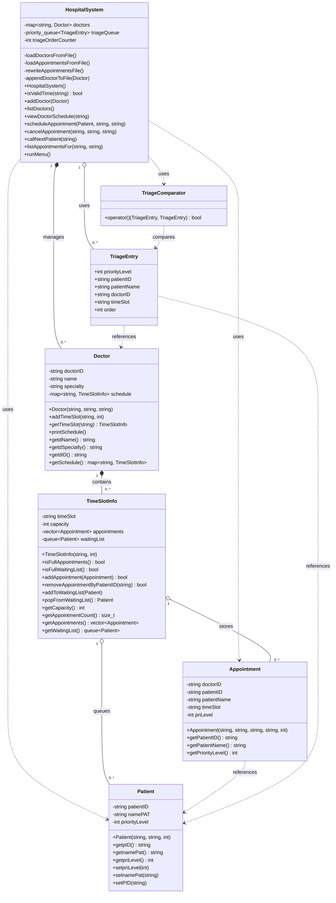
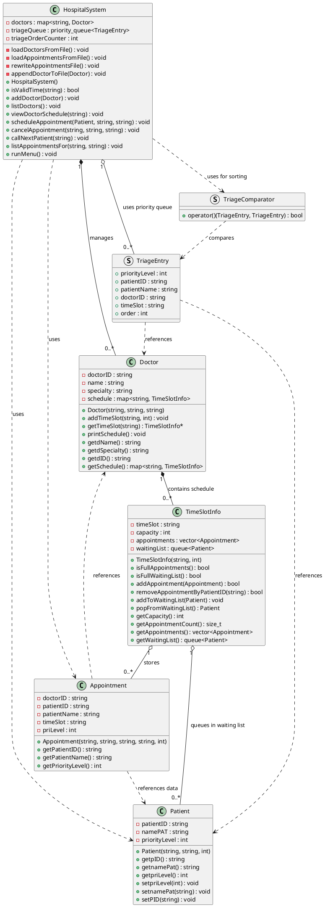

# Hospital Management System - UML Class Diagram

## Mermaid UML Diagram



## PlantUML Diagram (Alternative Format)



## Relationship Descriptions

### Composition (Filled Diamond - Strong Ownership)
- **HospitalSystem *-- Doctor**: HospitalSystem owns and manages Doctor objects. When HospitalSystem is destroyed, all Doctors are destroyed.
- **Doctor *-- TimeSlotInfo**: Doctor owns its TimeSlotInfo objects in the schedule map. When Doctor is destroyed, all TimeSlots are destroyed.

### Aggregation (Empty Diamond - Weak Ownership)
- **HospitalSystem o-- TriageEntry**: HospitalSystem contains TriageEntry objects in priority queue, but they can exist independently.
- **TimeSlotInfo o-- Appointment**: TimeSlotInfo contains Appointment objects, but appointments reference external patient data.
- **TimeSlotInfo o-- Patient**: TimeSlotInfo contains Patient objects in waiting list, but patients exist independently.

### Dependency (Dotted Arrow - Uses)
- **HospitalSystem ..> Patient**: HospitalSystem uses Patient objects in operations.
- **HospitalSystem ..> Appointment**: HospitalSystem uses Appointment objects.
- **HospitalSystem ..> TriageComparator**: HospitalSystem uses comparator for priority queue.
- **Appointment ..> Patient**: Appointment references patient information.
- **Appointment ..> Doctor**: Appointment references doctor information.
- **TriageEntry ..> Patient**: TriageEntry references patient data.
- **TriageEntry ..> Doctor**: TriageEntry references doctor ID.
- **TriageComparator ..> TriageEntry**: Comparator operates on TriageEntry objects.

## Key Design Patterns Visible in UML

### 1. Facade Pattern
**HospitalSystem** acts as a facade, providing simplified interface to complex subsystem of Doctor, Patient, Appointment, and TimeSlotInfo interactions.

### 2. Container Pattern
- **Doctor** contains multiple **TimeSlotInfo** objects (map container)
- **TimeSlotInfo** contains multiple **Appointment** objects (vector container)
- **TimeSlotInfo** contains multiple **Patient** objects in waiting list (queue container)
- **HospitalSystem** contains multiple **Doctor** objects (map container)

### 3. Strategy Pattern
**TriageComparator** defines comparison strategy for **TriageEntry** objects in priority queue.

### 4. Data Transfer Object (DTO)
**TriageEntry** and **Appointment** serve as DTOs carrying data between system components.

## Class Responsibilities

| Class | Primary Responsibility | Key Characteristic |
|:------|:----------------------|:-------------------|
| **HospitalSystem** | System Controller | Orchestrates all operations, manages doctors, handles triage |
| **Doctor** | Entity | Represents doctor with schedule management |
| **Patient** | Entity | Represents patient data |
| **Appointment** | Value Object | Immutable appointment record linking patient, doctor, time |
| **TimeSlotInfo** | Resource Manager | Manages capacity, appointments, and waiting list for time slot |
| **TriageEntry** | Data Structure | Priority queue element for patient calling |
| **TriageComparator** | Comparator | Defines priority ordering logic |

## Multiplicity Details

- **HospitalSystem → Doctor**: 1 to many (0..*)
  - One system manages multiple doctors
  
- **Doctor → TimeSlotInfo**: 1 to many (0..*)
  - One doctor has multiple time slots
  
- **TimeSlotInfo → Appointment**: 1 to many (0..*)
  - One time slot can have multiple appointments (up to capacity)
  
- **TimeSlotInfo → Patient**: 1 to many (0..*)
  - One time slot can have multiple patients in waiting list
  
- **HospitalSystem → TriageEntry**: 1 to many (0..*)
  - One system manages priority queue of triage entries

## Data Flow Diagram

```
User Input
    ↓
┌─────────────────────┐
│  HospitalSystem     │
│  (Facade/Controller)│
└──────────┬──────────┘
           │
           ├──→ Doctor ──→ TimeSlotInfo ──→ Appointment
           │                    │
           │                    └──→ Patient (waiting list)
           │
           └──→ TriageQueue (TriageEntry + TriageComparator)
                    ↓
              Patient Calling Order
```

## File Dependencies

```
MBA_5001230021.cpp (main)
    └── includes HospitalSystem.h
            ├── includes Patient.h
            ├── includes Doctor.h
            │       └── includes Timeslotinfo.h
            │               ├── includes Patient.h
            │               └── includes Appointment.h
            ├── includes Timeslotinfo.h (already included by Doctor.h)
            ├── includes Appointment.h (already included by Timeslotinfo.h)
            └── includes TriageEntry.h
```

---

*Generated UML Diagram for Hospital Management System*
*Date: December 29, 2025*
